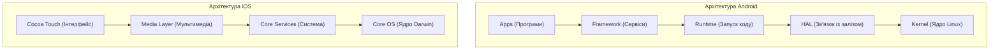

Практична робота 1: Загальний огляд мобільних платформ
Варіант 2: Архітектурне порівняння Android та iOS
1. Порівняння рівнів архітектури Android та iOS
Обидві мобільні операційні системи побудовані за багаторівневим принципом — від програм користувача до внутрішнього ядра системи.
Рівень Android [Джерело 1]	Рівень iOS [Джерело 2]	Что робить цей рівень
System Apps (Програми)	Cocoa Touch (Рівень UI)	Найвищий шар. Сюди входять програми, якими користуються: камера, телефон, браузер та додатки розробників.
Java API Framework	Media Layer / Core Services	Інструменти розробника. Допомагають виводити елементи на екран, працювати з мережею, картами чи запускати вікна.
C/C++ Libraries & Runtime	Core Services / Core OS	Рівень виконання коду. В Android тут працює віртуальне середовище (ART), а в iOS код виконується безпосередньо.
HAL (Абстракція заліза)	Core OS (Внутрішня система)	Перекладач між кодом програм та залізом смартфона (камерою, динаміками, датчиками).
Linux Kernel (Ядро Linux)	Core OS (Ядро Darwin)	Фундамент системи. Керує оперативною пам'яттю, безпекою пристрою та зарядом батареї.

2. Структура рівнів архітектури
Структура Android (від вищого до нижчого):
1. Applications Layer — Програми користувача (Камера, Телефон, Браузер).
2. Java API Framework — Керування вікнами, повідомленнями та екранами.
3. Android Runtime (ART) & Libraries — Запуск коду та базові бібліотеки.
4. HAL Layer — Зв'язок із залізом пристрою.
5. Linux Kernel — Драйвери, безпека та оперативна пам'ять.
Структура iOS (від вищого до нижчого):
1. Cocoa Touch Layer — Фреймворки інтерфейсу (кнопки, списки,UIKit/SwiftUI).
2. Media Layer — Робота з графікою, аудіо та мультимедіа.
3. Core Services Layer — Базові функції системи (мережеві запити, бази даних).
4. Core OS / Darwin Layer — Головне ядро системи, файли та безпека

Архітектурна діаграма

  3. Порівняння життєвого циклу екрана (Screen Lifecycle)

| Стадія екрана | Метод в Android [Джерело 3] | Метод в iOS [Джерело 4] |
| :--- | :--- | :--- |
| Екран створюється | `onCreate()` | `viewDidLoad()` |
| З'являється на екрані | `onStart()` | `viewWillAppear()` |
| Активний (можна натискати) | `onResume()` | `viewDidAppear()` |
| Частково перекритий | `onPause()` | Немає прямого аналога |
| Повністю сховався | `onStop()` | `viewWillDisappear()` / `viewDidDisappear()` |
| Закрився і видалився | `onDestroy()` | `deinit` |

Головні помилки розробників:
1. Зависання програми (Витік пам'яті): фонові оновлення не вимикаються при закритті екрана.
2. Втрата тексту при повороті: екран Android перестворюється, дані полів зникають без збереження.
3. Краш додатка у фоні: спроба оновити інтерфейс закритих або згорнутих екранів.

4. Практичні наслідки відмінностей для розробника
• Очищення пам'яті: В Android працює автоматичний Garbage Collector. В iOS розробник контролює зв'язки об'єктів вручну через weak.
• Поворот екрана: В Android екран повністю перезапускається заново. В iOS система просто адаптує поточні елементи під новий розмір.
• Робота у згорнутому стані: iOS суворо зупиняє фонові процеси додатків. Android дозволяє фонову роботу через Foreground Services.

5. Висновок
Для розробки нового проєкту обрано нативну розробку (Kotlin для Android + Swift для iOS) з архітектурою MVVM.
Аргументи:
1. Швидкість: програми працюють максимально плавно і швидко.
2. Нові фішки: доступ до оновлень ОС з'являється в перший день.
3. Менше багов: офіційні рідні інструменти забезпечують стабільність.
Визнаний ризик:
• Ціна та час: потрібно створювати та підтримувати два окремих додатки.

6. Джерела
Android Platform Architecture — https://source.android.com/docs/core/architecture (23.09.2026)
About the iOS Technologies — https://developer.apple.com/library/archive/documentation/MacOSX/Conceptual/OSX_Technology_Overview/AbouttheiOSTechnologies/AbouttheiOSTechnologies.html (23.09.2026)
Activity Lifecycle — https://developer.android.com/guide/components/activities/activity-lifecycle (23.09.2026)
Managing Your App's Life Cycle — https://developer.apple.com/documentation/uikit/app_and_environment/managing_your_app_s_life_cycle (23.09.2026)

