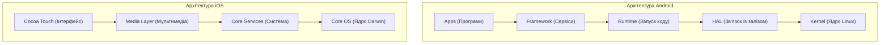

Практична робота 1: Загальний огляд мобільних платформ
Варіант 2: Архітектурне порівняння Android та iOS
1. Порівняння рівнів архітектури Android та iOS
Обидві мобільні операційні системи побудовані за багаторівневим принципом — від програм користувача до внутрішнього ядра системи.
Рівень Android [Джерело 1]	Рівень iOS [Джерело 2]	Что робить цей рівень
System Apps (Програми)	Cocoa Touch (Рівень UI)	Найвищий шар. Сюди входять програми, якими користуються: камера, телефон, браузер та додатки розробників.
Java API Framework	Media Layer / Core Services	Інструменти розробника. Допомагають виводити елементи на екран, працювати з мережею, картами чи запускати вікна.
C/C++ Libraries & Runtime	Core Services / Core OS	Рівень виконання коду. В Android тут працює віртуальне середовище (ART), а в iOS код виконується безпосередньо.
HAL (Абстракція заліза)	Core OS (Внутрішня система)	Перекладач між кодом програм та залізом смартфона (камерою, динаміками, датчиками).
Linux Kernel (Ядро Linux)	Core OS (Ядро Darwin)	Фундамент системи. Керує оперативною пам'яттю, безпекою пристрою та зарядом батареї.

2. Структура рівнів архітектури
Структура Android (від вищого до нижчого):
1. Applications Layer — Програми користувача (Камера, Телефон, Браузер).
2. Java API Framework — Керування вікнами, повідомленнями та екранами.
3. Android Runtime (ART) & Libraries — Запуск коду та базові бібліотеки.
4. HAL Layer — Зв'язок із залізом пристрою.
5. Linux Kernel — Драйвери, безпека та оперативна пам'ять.
Структура iOS (від вищого до нижчого):
1. Cocoa Touch Layer — Фреймворки інтерфейсу (кнопки, списки,UIKit/SwiftUI).
2. Media Layer — Робота з графікою, аудіо та мультимедіа.
3. Core Services Layer — Базові функції системи (мережеві запити, бази даних).
4. Core OS / Darwin Layer — Головне ядро системи, файли та безпека

Архітектурна діаграма

